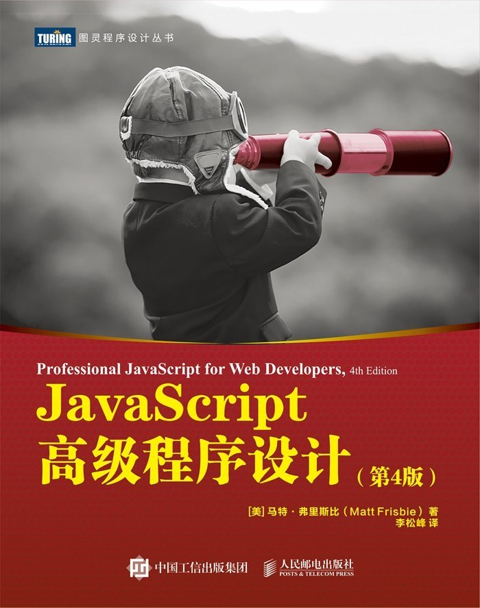

# JavaScript语言精粹

## 书籍简介

《JavaScript语言精粹》是由Douglas Crockford所著，被誉为JavaScript领域的经典之作。这本书并不厚，但它精确地指出了JavaScript中的精华和糟粕，帮助开发者更好地理解和使用这门语言。



## 为什么推荐

尽管JavaScript已经发展了多个版本，但这本书所讨论的核心概念和最佳实践至今仍然适用。作者Douglas Crockford是JavaScript领域的权威，他不仅深入浅出地讲解了JavaScript的精华部分，还毫不留情地指出了语言中应该避免使用的特性。

## 主要内容

### 精华部分

- **对象**：JavaScript中一切皆对象的概念
- **函数**：函数是第一类对象，闭包的强大特性
- **继承**：基于原型的继承模式
- **数组**：JavaScript数组的特性和常用方法
- **正则表达式**：强大的文本处理工具

### 避免的糟粕

- 全局变量
- `with`语句
- `eval`函数
- `==`运算符
- `void`运算符

## 代码示例

```javascript
// 一个好的对象字面量示例
var person = {
    name: 'John',
    sayName: function() {
        return 'My name is ' + this.name;
    }
};

// 使用闭包创建私有变量
function createCounter() {
    var count = 0;
    return {
        increment: function() {
            count += 1;
            return count;
        },
        getValue: function() {
            return count;
        }
    };
}

var counter = createCounter();
counter.increment(); // 1
counter.increment(); // 2
counter.getValue();  // 2
```

## 适合读者

这本书适合已经有一定JavaScript基础的开发者，希望深入理解语言特性并提高代码质量的程序员。对于初学者来说，可能需要先掌握一些基础知识再来阅读本书。

## 结论

《JavaScript语言精粹》虽然篇幅不大，但内容精炼，是每个JavaScript开发者书架上必备的一本书。通过学习这本书，你将能够避开JavaScript中的陷阱，写出更加简洁、高效、可维护的代码。